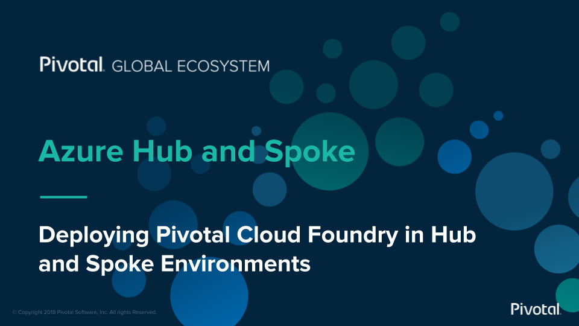

# Azure Reference Architecture with Pivotal Cloud Foundry

This set of labs will guide you through the process of deploying Azure Hub and Spoke Reference Architecture, Pivotal Control Plane on a spoke network and a Pivotal Application Service instance on another spoke network.

Below is the basic architecture of what this lab series will have you set up.

## Table of Contents

1. [Deploy Azure Hub and Spoke Reference Architecture](hub-and-spoke.md)
1. [Deploy Pivotal Control Plane on Spoke Network](control-plane)
1. [Deploy Pivotal Application Service on Spoke Network](pas)
